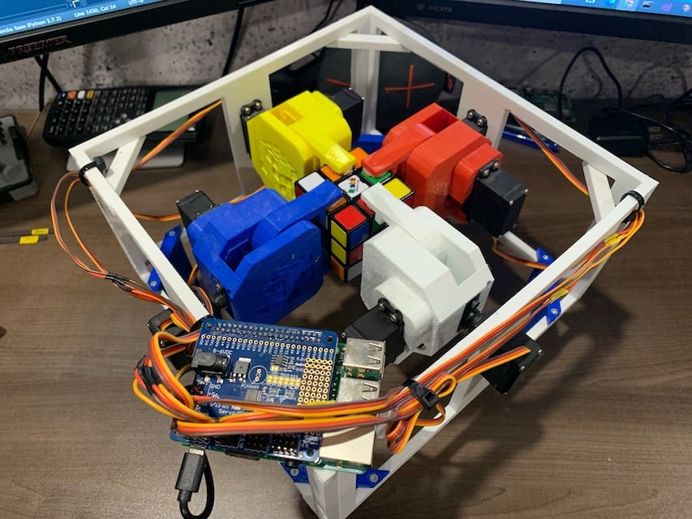

# RubpyxRobot
**3D Printed Rubik's Cube Solving Machine ;)**

An educational STEM open-source project from the [Innovation at Central Collegiate (I2C) Club](https://schools.prairiesouth.ca/centralcollegiate/) in Moose Jaw, Sask.

<table style="border:0px;">
  <tr style="border:0px;">
   <td style="border:0px;"></td>
   <td style="border:0px;"></td>
   <td style="border:0px;"></td>
  </tr>
</table>

**See the [GitHub Pages Project](https://ryan-brazeal-ufl.github.io/RubpyxRobot/) for full details**
